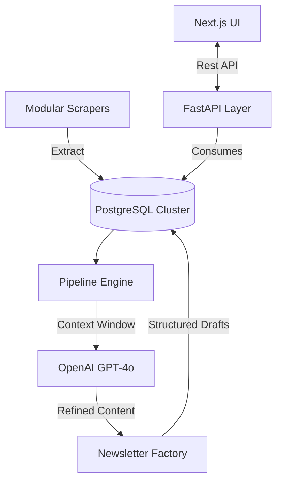

# Agentic Newsletter - Backend Core

The **Agentic Newsletter Backend** is a high-performance Python orchestration engine designed to automate the lifecycle of technical newsletters. It integrates advanced web scraping, intelligent content filtering, and GPT-powered summarization into a unified FastAPI-driven service.

---

## 🏗 Architecture & Data Flow



The system operates on a **Pull-Process-Publish** pattern:
1.  **Pull**: Scrapers distributed across articles, Reddit, LinkedIn, and PDFs gather raw intelligence.
2.  **Process**: The pipeline cleanses HTML, resolves tracking links, and deduplicates content.
3.  **Publish**: AI agents transform raw data into professional, tone-specific newsletter issues.

---

## 🛠 Tech Stack

- **Framework**: [FastAPI](https://fastapi.tiangolo.com/) (Asynchronous, High Performance)
- **Database**: [PostgreSQL](https://www.postgresql.org/) with [SQLAlchemy](https://www.sqlalchemy.org/) ORM
- **AI/LLM**: [OpenAI GPT-4o](https://openai.com/index/gpt-4o/) (Custom Prompt Orchestration)
- **Extraction Engine**: 
  - [Playwright](https://playwright.dev/) / [Selenium](https://www.selenium.dev/) (Dynamic Content)
  - [trafilatura](https://trafilatura.readthedocs.io/) (High-precision text extraction)
  - [newspaper3k](https://newspaper.readthedocs.io/en/latest/) (Metadata & Article parsing)
- **Social Connectors**: [Tweepy](https://www.tweepy.org/) (X/Twitter), [PRAW](https://praw.readthedocs.io/) (Reddit)
- **Task Runner**: Native Python async/await orchestration

---

## 📂 Internal Directory Walkthrough

```bash
backend/
├── api/             # API Layer (FastAPI)
│   ├── main.py      # Entry point & Route registration
│   └── models/      # Request/Response Pydantic schemas
├── core/            # Business Logic
│   └── engine.py    # Newsletter generation and AI orchestration
├── db/              # Persistence Layer
│   ├── connection.py# SQLAlchemy session management
│   └── models.py    # Database schema definitions
├── pipeline/        # Data Pipeline
│   └── pipeline.py  # Processing logic for scraped content
├── scrapers/        # Extraction Framework
│   ├── scraper_articles.py # Generic web article extraction
│   ├── scraper_linkedin.py # LinkedIn post gathering
│   ├── scraper_reddit.py   # Subreddit intelligence
│   └── scraper_pdfs.py     # Research paper processing
└── tests/           # Quality Assurance (Pytest)
```

---

## 🚀 Advanced Setup

### 1. Environment Preparation
```bash
# Initialize virtual environment
python -m venv venv
source venv/bin/activate  # Windows: venv\Scripts\activate

# Install dependencies
pip install -r requirements.txt
```

### 2. Dependency Installation
The backend requires specific binaries for extraction and NLP:
```bash
# Install Playwright browsers (Required for scrapers)
playwright install chromium

# Download NLTK datasets (Required for text processing)
python -c "import nltk; nltk.download('punkt'); nltk.download('averaged_perceptron_tagger')"
```

### 3. Database Migration
Ensure your PostgreSQL instance is running and your `.env` is configured, then initialize the schema:
```bash
python update_db_schema.py
```

---

## 📡 API Reference

| Endpoint | Method | Description |
| :--- | :--- | :--- |
| `/health` | `GET` | System health & DB connection status |
| `/newsletters` | `GET` | Fetch paginated newsletter history |
| `/generate` | `POST` | Trigger full pipeline (Scrape -> AI -> Save) |
| `/generate-article-summaries` | `POST` | AI summarization for specific raw items |
| `/linkedin-posts` | `GET` | Access cached/fresh LinkedIn intelligence |

Full documentation available at `http://localhost:8000/docs` (Swagger UI).

---

## 🏭 Deployment (Docker)

The backend is optimized for containerized environments:

```bash
# Build from project root
docker build -t newsletter-backend -f backend/Dockerfile .

# Run with environment injection
docker run -p 8000:8000 --env-file .env newsletter-backend
```

---

## 🤝 Development Guidelines

- **Adding Scrapers**: Inherit from the base scraper logic and implement standard error handling for diverse HTML structures.
- **Prompt Engineering**: AI prompts are located in `backend/core/engine.py`. Test prompt changes against the `tests/` suite before merging.
- **Logging**: All system events are logged to `newsletter.log`. High-priority errors are piped to `stderr`.
